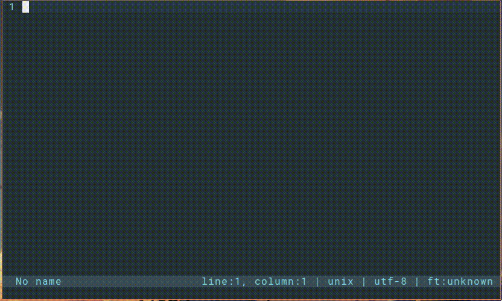

# FZFinder plugin for micro editor

The plugin allows you to integrate **fzf** to select and search for your project files.

## Information

Tested version: Micro 2.0.10; fzf 0.27.2

The advantages of my implementation:
- Ability to set the `fzf` parameters through the settings file
- Solved problem with a critical error when selecting a file
- I plan to support plugin 

## Installation

This plugin for work requires `fzf`, install it in your system.

To install the plugin in `micro editor`, add to the `settings.json`:

~~~bash
micro ~/.config/micro/settings.json
~~~

~~~json
"pluginrepos": ["https://raw.githubusercontent.com/MuratovAS/micro-fzfinder/main/repo.json"],
~~~

Installing the plugin in micro editor

~~~bash
micro -plugin install fzfinder
~~~

## Settings 

Fzf parameters can be set by means of `options` in the file `settings.json`:

~~~json
"fzfarg": "--layout=reverse  --preview 'cat {}' --color=bw",
~~~

We can also configure launch through `hot keys` in the file  `bindings.json`:

~~~json
"Alt-Tab": "command:fzfinder",
~~~

## Credits

A good example of the development of plugins: [micro-editor/updated-plugins](https://github.com/micro-editor/updated-plugins  )  

The idea is inherited from the already unsupported expansion: [samdmarshall/micro-fzf-plugin](https://github.com/samdmarshall/micro-fzf-plugin ) 

